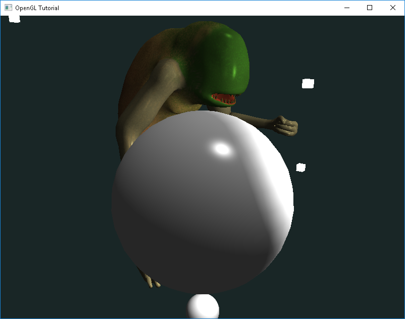

# Game engine powered with OpenGL
This repository shows my process of learning OpenGL. Right now it's a very basic game that lets you to move freely camera, toggle lights and shoot spheres. In order to make program work, it is recommended to add classes each to implement behaviour like: mouse/keyboard events, collecting mesh datas, compiling shaders etc.\
The reason of creating game engine in OpenGL is to learn how OpenGL works and as a passion of games to create first big own project that wiukd be compatible with most operation systems like Windows, Linux or MacOS or other devices. For that moment, it's possible to compile and run on Windows (tested with MSYS2) and Linux (X11).

## Libraries
Some libraries needs to be included in order to run engine:
* GLFW (Graphics Library Framework) - easily creates window and react on keyboard keys and mouse movement
* GLM (OpenGL Mathematics) - GLSL 
* STB - loads textures for 3D model

## Screenshots

